# Olá, sou Lucas de Godoy

Estudante de Análise e Desenvolvimento de Sistemas no Instituto Federal de Santa Catarina.

Jornalista, mestre e especialista em Comunicação pela Universidade Estadual de Londrina, com mais de 10 anos de experiência em assessoria de comunicação e projetos socio­culturais. Trabalhei com comunicação estratégica, conteúdo, audiovisual, mídias sociais e iniciativas de impacto social.

Atualmente, estou em transição para desenvolvimento Backend, com foco em Java, Spring Boot, JUnit e boas práticas de arquitetura. Já desenvolvi projetos com JavaScript, Node.js, HTML, CSS, WordPress e possuo conhecimento básico em Python.

Desejo unir minha experiência em comunicação com a tecnologia para criar soluções eficientes, criativas e orientadas a resultados.

## 🚀 O que estou estudando

- Java
- Estruturas de Dados e Algoritmos
- Testes com JUnit
- Gradle, modularização e JavaFX
- Boas práticas de código (SOLID, Clean Code)
- Spring Boot (REST, JPA, Security)
- Projetos pessoais e PoCs para portfólio

## 🛠️ Tecnologias

 

## 📌 Principais Projetos (Backend / Java)

- Board de Tarefas (Java + JavaFX + H2)
[https://github.com/lucasgch/simple-task-board-manager](https://github.com/lucasgch/simple-task-board-manager)

- Academia Digital (Java + Spring Boot no BackEnd e React no Front)
https://github.com/lucasgch/academia-digital

- Diversos exercícios e projetos em Java, estou sempre atualizando
(Lista completa no meus repositórios)

## 📂 Outros Projetos (JS / Frontend / Games)

- Autocomplete com Trie — JS
https://github.com/lucasgch/trie-form-autocomplete

- Jogos em JS e páginas web responsivas.
(Lista completa no meus repositórios)

- Tema WordPress — Caminhos da Longevidade
https://caminhosdalongevidade.com.br/

- Porfolio dev
https://github.com/lucasgch/portfoliodev

## 📘 Estudos e formações

- Entendendo Algoritmos — Aditya Bhargava - https://github.com/lucasgch/EntendendoAlgoritmos
- Estrutura de Dados com Prof. Isidro - https://github.com/lucasgch/Estrutura-de-dados
- Bootcamp Bradesco – Java Cloud Native (90h)
- Formação Java Fundamentals (35h) — DIO
- Frontend do Zero (75h) — DIO
- Rocketseat HTML/CSS

---

## 🤝 Conecte-se e Colabore

Estou em busca de oportunidades, desafios e projetos interessantes.
Se quiser trocar ideias sobre Java Backend, testes, arquitetura, DevOps ou estudos de TI, me chame!

📧 Email: [lucasgodoyjor@gmail.com](mailto:lucasgodoyjor@gmail.com) 
🔗 LinkedIn: [Lucas Godoy](https://www.linkedin.com/in/lucasgch/)

---

## Socials

  <a href="https://www.linkedin.com/in/lucasgch/" target="_blank" rel="noreferrer">LinkedIn</a>&nbsp; | &nbsp;
  <a href="https://www.hackerrank.com/profile/lucasgodoyjor" target="_blank" rel="noreferrer" alt="HackerRank">HackerRank</a>&nbsp; | &nbsp;
  <a href="http://www.instagram.com/desviante" target="_blank" rel="noreferrer">Instagram</a>&nbsp; | &nbsp;
  <a href="https://www.facebook.com/lucasGodoyCh/" target="_blank" rel="noreferrer">Facebook</a>&nbsp; | &nbsp;
  <a href="https://www.github.com/lucasgch" target="_blank" rel="noreferrer">GitHub</a>&nbsp; | &nbsp;
  <a href="https://www.youtube.com/@Lucas-rr2il" target="_blank" rel="noreferrer">YouTube</a>&nbsp; | &nbsp;
  <a href="https://audesviante.hashnode.dev/" target="_blank" rel="noreferrer">Hashnode blog</a>&nbsp; | &nbsp;
  <a href="https://t.co/G5jzD5vcBE" target="_blank" rel="noreferrer">Hyperskill: Site com exercícios para aprender programação passo a passo</a>&nbsp; | &nbsp;
  <a href="https://roadmap.sh/befriend?u=6709b231fb4be684db425622 target="_blank" rel="noreferrer">Roadmap.sh</a>&nbsp;

## Github Stats

  
  &nbsp; &nbsp; 

  

---

## Meus projetos

<ul>
  <li><a href="https://github.com/lucasgch/portfoliodev" target="_blank">Portfolio Dev</a></li>
  <li><a href="https://lucasgch.github.io/devlinks/" target="_blank">Meus links pessoais</a></li>
  <li><a href="https://github.com/lucasgch/desafio-board-dio" target="_blank">Board de Tarefas em Java, H2 e JavaFX</a></li>
  <li><a href="https://github.com/lucasgch/trie-form-autocomplete" target="_blank">Autocomplete em Javascript com estrutura de dados Trie</a></li>
  <li><a href="https://caminhosdalongevidade.com.br/" target="_blank">Tema Wordpress e site: Caminhos da Longevidade</a></li>  
  <li><a href="https://github.com/lucasgch/JavaProjects" target="_blank">5 Projetos práticos com Java: Dice roller simulator; Word guessing game; Password generator; File manager; Weather Forecast Application</a></li>   
  <li><a href="https://github.com/lucasgch/JavaFizzBuzzWithCucumber" target="_blank">FizzBuzz com Java, Maven e Cucumber</a></li>
  <li><a href="https://github.com/lucasgch/TicTacToe" target="_blank">Jogo da velha com 3 níveis de dificuldade</a></li>
  <li><a href="https://github.com/lucasgch/snake-game" target="_blank">Snake Game em JS, CSS e HTML</a></li>
  <li><a href="https://github.com/lucasgch/dndinitiativecalculator" target=_blank">Calculadora de Iniciativa D&D</a></li>
  <li><a href="https://github.com/lucasgch/detona-ralph" target=_blank">Mini game Detona Ralph - Html/Javascript/CSS</a></li>
  <li><a href="https://github.com/lucasgch/memory-game" target=_blank">Jogo da memória - Html/Javascript/CSS</a></li>
  <li><a href="https://github.com/lucasgch/js-yugioh-assets" target=_blank">Jogo Yu-Gi-Oh | Jo-ken-po Edition - Html/Javascript/CSS</a></li>
  <li><a href="https://github.com/lucasgch/Pokedex" target=_blank">Pokedex que busca dados da PokeApi em Javascript/HTML/CSS</a></li>
  <li><a href="https://github.com/lucasgch/piano" target=_blank">Simulador de piano em Javascript/HTML/CSS</a></li>
  <li><a href="https://lucasgch.github.io/patinsanimation" target="_blank">Landing page com animações em CSS</a></li>
  <li><a href="https://github.com/lucasgch/landingpage-trilhacss-dio" target="_blank">Landing page Trilha CSS DIO</a></li>
  <li><a href="https://github.com/lucasgch/LandingPageMundoInvertido" target="_blank">Landing page Mundo Invertido</a></li>
  <li><a href="https://lucasgch.github.io/travelgram" target="_blank">Travelgram</a></li>
  <li><a href="https://lucasgch.github.io/portaldenoticias/" target="_blank">Portal de notícias</a></li>
  <li><a href="https://lucasgch.github.io/formulariodematricula/" target="_blank">Formulário de Matrícula</a></li>
  <li><a href="https://lucasgch.github.io/recipepage/" target="_blank">Página de receitas</a></li>
</ul>
